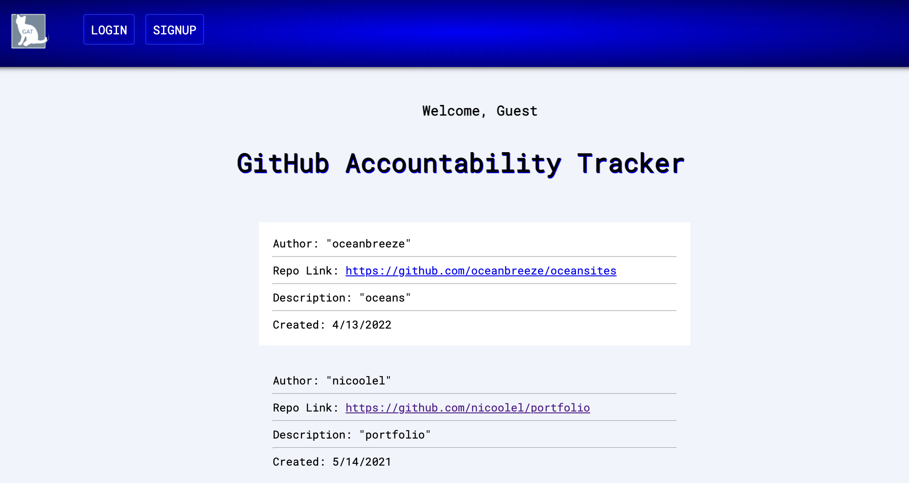
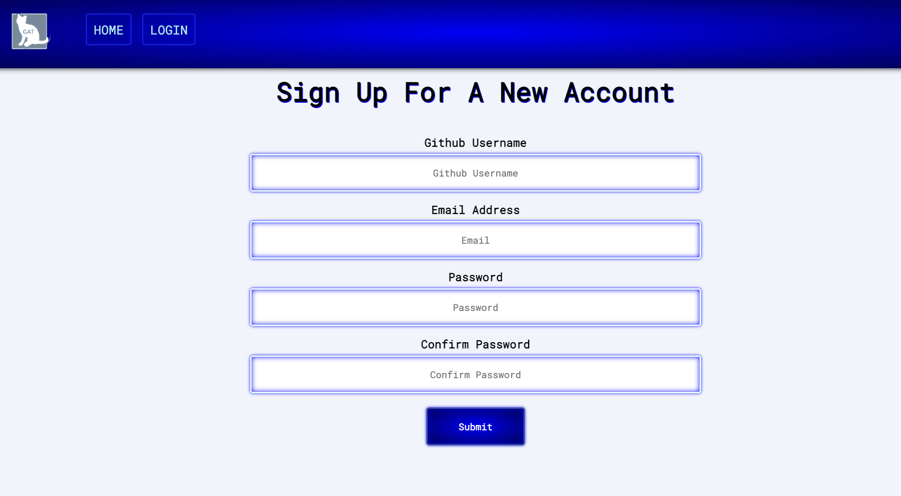
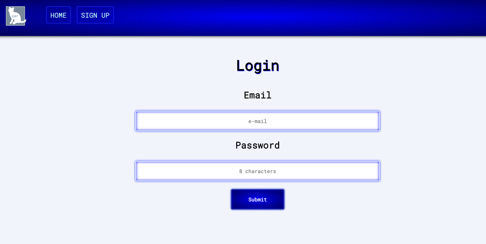

# Github Accountability Tracker

Getting the green squares on Github is so satisfying and so is
sharing your Github pushes with others. 

This app is made to encourage developers to push every day. Users are able to like other Github posts from their friends or colleagues.
The owner of the post has a delete feature.
## How It's Made

**Tech Stack:** EJS, MongoDB, Node.js, Express

## Installation

`npm install`

## Things To Add

Create a `.env` file and add the following as `key = value`
  - PORT = 3000 (can be any port example: 2121)
  - DB_STRING = `your database URI`

---

# Run

`npm start`
## App Preview

